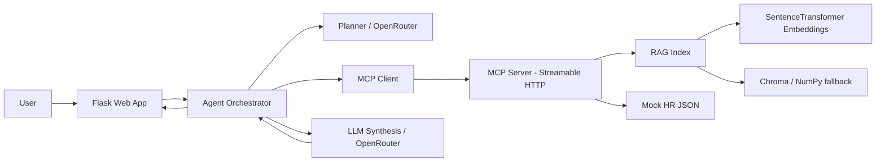

# Design and Evaluation

## 1. Architecture

The application is intentionally deployable as one free-tier service. The web process starts the MCP server as a local subprocess and communicates with it using the MCP Streamable HTTP transport. This matches the project brief's permitted single-service architecture.

## 2. RAG design

- Corpus: 10 synthetic internal HR policy documents in Markdown.
- Loader: supports Markdown/TXT, HTML and PDF through `document_loader.py`.
- Chunking: deterministic section-aware ingestion followed by overlapping word windows (900 words, 120-word overlap).
- Embeddings: `sentence-transformers/all-MiniLM-L6-v2` locally.
- Vector storage: Chroma persistent collection where available, with persisted NumPy vectors as a lightweight fallback.
- Retrieval: top-k semantic retrieval, default `k=4`.
- Citation metadata: document ID, title, section, source file, chunk ID and source snippet.
- Guardrail: if the corpus has no supporting evidence, the agent says it cannot safely answer from internal policy and directs the user to HR.

## 3. Agent orchestration

The planner identifies the workflow and creates a constrained tool plan. When an OpenRouter key is configured, the planner uses a low-temperature JSON-only planning prompt. If the provider is unavailable, deterministic workflow planning is used so the system remains demonstrable.

The orchestrator then invokes the tools through the MCP client. It does not import the MCP tool functions directly. Each request starts an MCP server subprocess, calls `initialize`, calls `list_tools`, validates the selected tool names, and invokes the tools using MCP `call_tool`.

Only operational traces are returned to the UI. Hidden chain-of-thought is not exposed.

## 4. MCP tools

| Tool | Purpose | Data source |
|---|---|---|
| `search_policy_documents` | Semantic policy retrieval | RAG index |
| `get_policy_section` | Targeted policy evidence | RAG index |
| `lookup_employee_profile` | Employee context | synthetic JSON |
| `check_pto_balance` | PTO balance | synthetic JSON |
| `lookup_benefits_status` | Benefits status | synthetic JSON |
| `check_policy_compliance` | Conservative policy review | RAG + employee data |
| `create_mock_hr_ticket` | Demonstration-only ticket | mock operation |
| `draft_hr_email` | Draft only, never sent | synthetic employee data |

## 5. Required end-to-end workflows

### Workflow A — Remote work eligibility

Expected sequence:

1. `lookup_employee_profile(employee_id)`
2. `search_policy_documents(query=remote work/location/security/approval)`
3. `check_policy_compliance(policy_area=remote work, employee_id, details)`
4. Grounded answer with policy citations and explicit note that the result is guidance, not legal/tax approval.

### Workflow B — PTO request guidance

Expected sequence:

1. `lookup_employee_profile(employee_id)`
2. `check_pto_balance(employee_id)`
3. `search_policy_documents(query=PTO notice/approval)`
4. Optional `draft_hr_email(...)` when the user asks for a manager message.
5. Grounded answer that separates available balance from approval.

## 6. Safety guardrails

- Synthetic data only.
- No real HR system is updated.
- Mock tickets are clearly labelled.
- Email drafts are never sent.
- Missing employee IDs produce clarification.
- Missing policy evidence produces a safe refusal/redirect.
- Sensitive case triage is not treated as an investigation.
- The UI displays operational trace information, not hidden reasoning.

## 7. Failure handling

If the MCP process is unavailable, the user receives a safe error and no action is taken. Unknown employee IDs return a structured not-found response. The planner validates tool names against the discovered MCP tool list. The synthesis layer falls back to a deterministic grounded response if the LLM provider fails.

## 8. Evaluation

`evaluation/questions.json` contains 24 cases. `run_evaluation.py` reports groundedness, citation accuracy, tool-selection accuracy, workflow completion, action-safety pass rate and p50/p95 latency. `ablation.py` compares retrieval k values.

The metrics are engineering-oriented heuristics. They should be run in the same environment used for the final demonstration so the reported values are reproducible.

## 9. Free-tier deployment

Render can run the web app, RAG index, mock data, MCP server and agent in a single service. The API key is supplied through environment variables. The RAG index is built during deployment. A free-tier service may sleep between requests, so the README documents cold-start behaviour.
